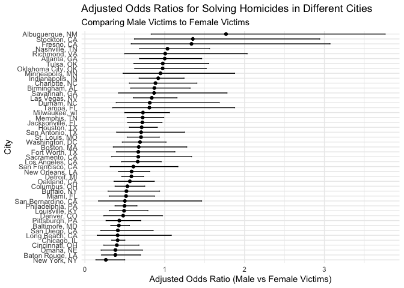
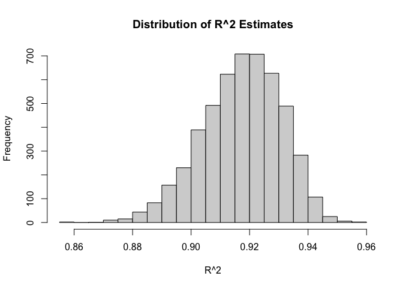
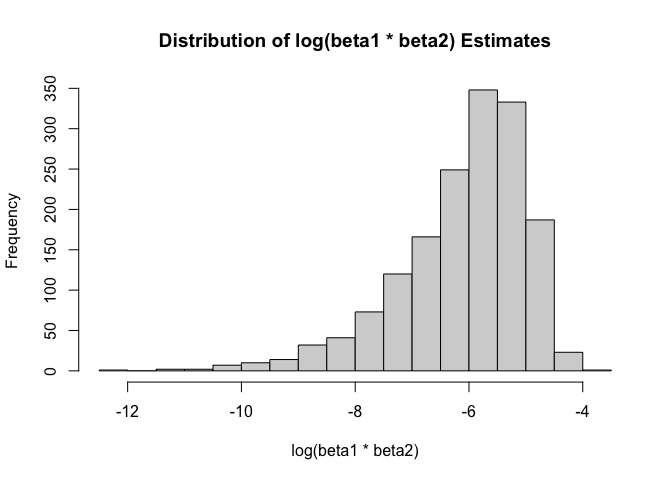

p8105_hw6_anw2158
================
Aung Nay Win

``` r
library(dplyr)
```

    ## 
    ## Attaching package: 'dplyr'

    ## The following objects are masked from 'package:stats':
    ## 
    ##     filter, lag

    ## The following objects are masked from 'package:base':
    ## 
    ##     intersect, setdiff, setequal, union

``` r
library(broom)
library(purrr)
library(ggplot2)
library(tidyr)
library(boot)
```

### Problem 1

``` r
homicide_data = read.csv("./data/homicide-data.csv")

homicide_data = homicide_data |> 
  mutate(
    city_state = paste(city, state, sep = ", "),
    victim_age = as.numeric(victim_age),
    solved = ifelse(grepl("Closed by arrest", disposition, ignore.case = TRUE), 1, 0)
    ) |> 
  filter(!city_state %in% c("Dallas, TX", "Phoenix, AZ", "Kansas City, MO", "Tulsa, AL"),
         victim_race %in% c("White", "Black"),
         !is.na(victim_age)
         )
```

    ## Warning: There was 1 warning in `mutate()`.
    ## ℹ In argument: `victim_age = as.numeric(victim_age)`.
    ## Caused by warning:
    ## ! NAs introduced by coercion

``` r
baltimore_data = filter(homicide_data, city_state == "Baltimore, MD")

model_baltimore = glm(solved ~ victim_age + victim_sex + victim_race, 
                       data = baltimore_data, family = binomial())

tidy_model = tidy(model_baltimore)

tidy_model |> 
  filter(term == "victim_sexMale") |> 
  mutate(
    odds_ratio = exp(estimate),
    lower_ci = exp(estimate - 1.96 * std.error),
    upper_ci = exp(estimate + 1.96 * std.error)
  )
```

    ## # A tibble: 1 × 8
    ##   term        estimate std.error statistic  p.value odds_ratio lower_ci upper_ci
    ##   <chr>          <dbl>     <dbl>     <dbl>    <dbl>      <dbl>    <dbl>    <dbl>
    ## 1 victim_sex…   -0.854     0.138     -6.18 6.26e-10      0.426    0.325    0.558

``` r
city_models = homicide_data |> 
  group_by(city_state) |> 
  do(
    tidy_glm = tidy(glm(solved ~ victim_age + victim_sex + victim_race, 
                        data = ., family = binomial()))
  )

city_or = city_models |> 
  unnest(tidy_glm) |> 
  filter(term == "victim_sexMale") |> 
  mutate(
    odds_ratio = exp(estimate),
    lower_ci = exp(estimate - 1.96 * std.error),
    upper_ci = exp(estimate + 1.96 * std.error)
  )
```

``` r
city_or_ordered = city_or |> 
  arrange(odds_ratio)

ggplot(city_or_ordered, aes(x = reorder(city_state, odds_ratio), y = odds_ratio)) +
  geom_point() +
  geom_errorbar(aes(ymin = lower_ci, ymax = upper_ci), width = 0.2) +
  coord_flip() +  
  labs(x = "City", y = "Adjusted Odds Ratio (Male vs Female Victims)", 
       title = "Adjusted Odds Ratios for Solving Homicides in Different Cities",
       subtitle = "Comparing Male Victims to Female Victims") +
  theme_minimal()
```

<!-- -->
The plot shows the adjusted odds ratios (ORs) for solving homicides in
various cities, comparing male to female victims. A significant
variation in ORs across cities is observed, with some cities more likely
to solve homicides involving male victims, while others show the
opposite trend or no clear disparity. Points with confidence intervals
not crossing the OR of 1 indicate statistically significant differences
in the likelihood of solving cases based on victim gender. Notably, New
York, NY, shows a much higher likelihood of solving homicides with
female victims, whereas cities like Albuquerque, NM, display a higher
likelihood when victims are male. The wide range of confidence intervals
suggests varying degrees of certainty about these estimates, emphasizing
the need to consider local context and data quality when interpreting
these findings.

### Problem 2

``` r
weather_df = 
  rnoaa::meteo_pull_monitors(
    c("USW00094728"),
    var = c("PRCP", "TMIN", "TMAX"), 
    date_min = "2022-01-01",
    date_max = "2022-12-31") |>
  mutate(
    name = recode(id, USW00094728 = "CentralPark_NY"),
    tmin = tmin / 10,
    tmax = tmax / 10) |>
  select(name, id, everything())
```

    ## using cached file: /Users/ronnieyanf/Library/Caches/org.R-project.R/R/rnoaa/noaa_ghcnd/USW00094728.dly

    ## date created (size, mb): 2023-10-11 11:34:28.770061 (8.534)

    ## file min/max dates: 1869-01-01 / 2023-10-31

``` r
boot_function = function(data, indices) {
  boot_data = data[indices, ]
  model = lm(tmax ~ tmin + prcp, data = boot_data)
  glance_data = glance(model)
  tidy_data = tidy(model)
  
  r_squared <- glance_data$r.squared
  
   beta1 <- tidy_data$estimate[tidy_data$term == "tmin"]
  beta2 <- tidy_data$estimate[tidy_data$term == "prcp"]
  if (beta1 <= 0 || beta2 <= 0) {
    log_betas <- NA  # Assign NA if product of betas is not positive
  } else {
    log_betas <- log(beta1 * beta2)
  }
  
  return(c(r_squared, log_betas))
}

set.seed(123)  
bootstrap_results = boot(data = weather_df, statistic = boot_function, R = 5000)
```

``` r
r_squared_estimates <- bootstrap_results$t[,1]
log_betas_estimates <- bootstrap_results$t[,2]
```

``` r
hist(r_squared_estimates, main = "Distribution of R^2 Estimates", xlab = "R^2")
```

<!-- -->
The histogram provided represents the distribution of R^2 estimates
obtained from 5000 bootstrap samples in a simple linear regression
analysis with `tmax` as the response variable and `tmin` and `prcp` as
predictors. The distribution appears to be fairly normal, centering
around a high R^2 value, which suggests a strong explanatory power of
the model. The concentration of estimates around the peak indicates
consistency in the bootstrap resamples, implying that the model is
stable across different samples drawn from the data. The shape of the
distribution, without significant skewness or extreme outliers, provides
confidence in the reliability of the R^2 statistic for this regression
model in the given data set.

``` r
hist(log_betas_estimates, main = "Distribution of log(beta1 * beta2) Estimates", xlab = "log(beta1 * beta2)")
```

<!-- -->
The histogram shows the distribution of the estimated natural logarithm
of the product of two regression coefficients (presumably beta 1 for
tmin and beta 2 for prcp) from 5000 bootstrap samples. The distribution
is skewed to the left, suggesting that the product of beta 1 and beta 2
is typically less than 1, since the logarithm of numbers less than 1 is
negative. The tail extending towards the lower values indicates that
there are occasional bootstrap samples where the product of the
coefficients is very small. The concentration of the estimates around
the mode of the distribution indicates that there’s a common range for
the logarithm of the product where most of the bootstrap samples fall,
but the skewness signifies that the relationship captured by the model
may vary across different samples, possibly due to the presence of
outliers or influential points in the data.

``` r
ci_r_squared <- quantile(r_squared_estimates, c(0.025, 0.975), na.rm = TRUE)
ci_log_betas <- quantile(log_betas_estimates, c(0.025, 0.975), na.rm = TRUE)
```

``` r
list(ci_r_squared = ci_r_squared, ci_log_betas = ci_log_betas)
```

    ## $ci_r_squared
    ##      2.5%     97.5% 
    ## 0.8886348 0.9403299 
    ## 
    ## $ci_log_betas
    ##      2.5%     97.5% 
    ## -8.957548 -4.551465

### Problem 3
